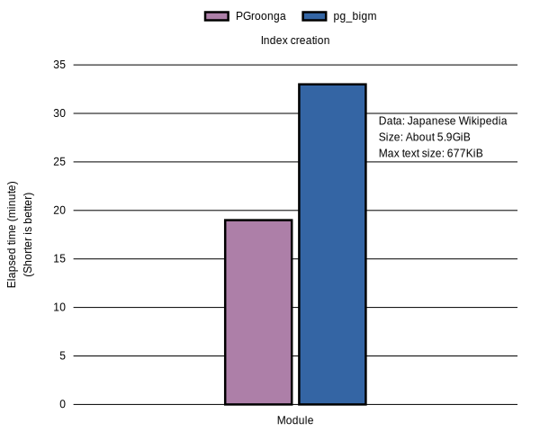

# PGroonga対pg\_bigm

PostgreSQLはデフォルトではアルファベットベースではない言語の全文検索をサポートしていません。たとえば、日本語・中国語・韓国語といったアジアの言語の全文検索をサポートしていません。アジアの言語をサポートしたサードパーティーのモジュールがあります。PGroongaはそのうちのひとつです。他にも[pg\_bigm](http://pgbigm.osdn.jp/)というモジュールがあります。textsearchのパーサーもあります。たとえば、[zhparser](https://github.com/amutu/zhparser)は中国語用のパーサーで、[textsearch\_ja（メンテナンスされていません）](http://textsearch-ja.projects.pgfoundry.org/textsearch_ja.html)は日本語用のパーサーです。

pg\_bigmモジュールは[pg\_trgm]({{ site.postgresql_doc_base_url.ja }}/pgtrgm.html)モジュールと似ています。pg\_trgmモジュールはデフォルトではアジアの言語をサポートしていませんが、pg\_bigmはサポートしています。

このドキュメントはPGroongaとpg\_bigmの違いを説明します。

## 特徴

各モジュールの特徴は次の通りです。

### PGroonga {#pgroonga}

「recheck」する必要がないのでPGroongaの検索は高速です。

PGroongaは更新中の検索をブロックしないので更新中も高速に検索できます。PGroongaは更新中も検索性能を落としません。

PGroongaはアルファベットベースの言語とアジアの言語が混ざっている場合も高速です。PGroongaはデフォルトでN-gramベースの全文検索を使います。これはpg\_bigmと似ています。なぜなら、pg\_bigmは2-gram（N-gramのNが2のケース）を使っているからです。しかし、PGroongaは可変長サイズのN-gramを使っています。N-gramはアルファベットベースの言語では遅くなりがちです。これは、アルファベットの字種が少ないからです。字種はだいたい26（「a」から「z」までと他にいくつか）になります。字種が少ないと転置インデックスのポスティングリストが長くなりがちです。（転置インデックスに詳しくないとこの説明はピンとこないかもしれません。）[PGroonga対textsearch対pg\_trgm](pgroonga-versus-textsearch-and-pg-trgm.html)も参照してください。N-gramベースの全文検索であるpg\_trgmが遅めなのがわかります。PGroongaは「私はPostgreSQLユーザーです。」というようにアルファベットベースの言語とアジアの言語が混ざっているときでもアルファベットベースの言語にはN-gramベースの全文検索ではなく単語ベースの全文検索を使います。

PGroongaは更新も高速です。

PGroongaはPostgreSQLに保存しているインデックス対象のテキストも保存しているのでインデックスサイズは大きいです。

PGroongaのインデックスはクラッシュセーフではありません。もし、クラッシュしてPGroongaのインデックスが壊れた場合は[`REINDEX`]({{ site.postgresql_doc_base_url.ja }}/sql-reindex.html)を実行する必要があります。

### pg\_bigmモジュール {#pg-bigm}

pg\_bigmモジュールはクラッシュセーフです。なぜならGINを使っているからです。GINはクラッシュセーフです。

pg\_bigmモジュールは大量のドキュメントがマッチして各ドキュメントが長い場合は遅いです。なぜならpg\_bigmはインデックスを使った検索の後に「recheck」する必要があるからです。

### 概要 {#summary}

モジュール  | サポートしている言語 | 検索 | 更新 | インデックスサイズ
---------- | -------------------- | ---- | ---- | ----------------
PGroonga   | 全言語               | 速い | 速い | 大きい
pg\_bigm   | 全言語               | 遅い | 遅い | 小さい

## ベンチマーク {#benchmark}

このセクションでは日本語版Wikipediaを使ったベンチマーク結果を示します。ベンチマークスクリプトは[postgresql.sh](https://github.com/groonga/wikipedia-search/blob/master/benchmark/centos7/postgresql.sh)にあります。

### 概要

以下は全文検索インデックス作成のベンチマーク結果の概要です。

  * PGroongaが一番速いモジュールです。

  * pg\_bigmはPGroongaよりも約73%遅いです。



以下は全文検索インデックスのサイズのベンチマーク結果の概要です。

  * pg\_bigmが一番小さいモジュールです。

  * PGroongaはpg\_bigmよりも約2.3倍大きいです。


以下は全文検索性能のベンチマーク結果の概要です。

  * pg\_bigmの全文検索性能は他のモジュールよりも約50倍遅いです。ただし、「日本」（クエリーが2文字のケース）は遅くありません。

  * PGroongaとGroongaの全文検索性能は似ています。ただし、「日本」（ヒット数が多いケース）ではGroongaの方が10倍高速です。


以下はpg\_bigmが他のモジュールより約50倍遅いのでpg\_bigmを除いた全文検索性能のグラフです。


### 環境

以下はベンチマーク環境です。

CPU        | Intel(R) Xeon(R) CPU E5-2660 v3 @ 2.60GHz (24cores)
メモリー   | 32GiB
スワップ   | 2GiB
ストレージ | SSD (500GB)
OS        | CentOS 7.2

### バージョン

以下はソフトウェアのバージョンです。

PostgreSQL | PGroonga | pg\_bigm
---------- | -------- | ------------
9.6.1      | 1.1.9    | 1.2-20161011

### データ

以下は対象データの統計情報です。

サイズ                | 約5.9GiB
レコード数            | 約90万件
タイトルの平均バイト数 | 約21.6B
タイトルの最大バイト数 | 250B
本文の平均バイト数     | 約6.7KiB
本文の最大バイト数     | 約677KiB

### データロード

以下はデータロードのベンチマーク結果です。全文検索モジュールには依存しません。なぜならどのインデックスもまだ作られていないからです。

経過時間 | データベースサイズ
-------- | -----------------
約5分    | 約5GB

以下はデータをロードするSQLです。

```sql
COPY wikipedia FROM 'ja-all-pages.csv' WITH CSV ENCODING 'utf8';
```

このCSVデータは[ja-all-pages.csv.xz](http://packages.groonga.org/tmp/ja-all-pages.csv.xz)からダウンロードできます。

以下は`wikipedia`テーブルを定義するSQLです。

```sql
CREATE TABLE wikipedia (
  id integer PRIMARY KEY,
  title text,
  text text
);
```

### インデックス作成

以下は全文検索インデックス作成のベンチマーク結果です。

モジュール | 経過時間 | インデックスサイズ | 備考
---------- | ------- | ------------------ | -------------------------------------------------------------------------------------------------------------
PGroonga   | 約19分  | 約9.8GB            | PGroongaはデータをコピーしてそれに対してインデックスを作成します。データはzlibで圧縮しています。インデックスだけのサイズは約6.4GBです。
pg\_bigm   | 約33分  | 約4.2GB            | `maintenance_work_mem`は`2GB`です。

PGroongaのインデックス定義は以下の通りです。

```sql
CREATE INDEX wikipedia_index_pgroonga ON wikipedia
 USING pgroonga (title, text);
```

pg\_bigmのインデックス定義は以下の通りです。

```sql
CREATE INDEX wikipedia_index_pg_bigm ON wikipedia
 USING GIN (title gin_bigm_ops, text gin_bigm_ops);
```

### 全文検索

全文検索のベンチマーク結果は以下の通りです。

  * 「Groonga」は`pgroonga.command('select ...')`の結果です。[`pgroonga.command`](functions/pgroonga-command.html)も参照してください。

  * 「相対経過時間」は対象の経過時間と最速のケースの経過時間の比率です。大きいほど遅いです。

クエリー：「テレビアニメ」

モジュール | 経過時間    | ヒット数 | 相対経過時間
---------- | ---------- | -------- | -----------
PGroonga   | 約65ミリ秒 | 約2万件   | 約1.1
Groonga    | 約38ミリ秒 | 約2万件   | 1
pg\_bigm   | 約2.8秒    | 約2万件   | 約4.8

クエリー：「データベース」

モジュール | 経過時間    | ヒット数  | 相対経過時間
---------- | ---------- | --------- | -----------
PGroonga   | 約49ミリ秒 | 約1万5千件 | 約1.6
Groonga    | 約31ミリ秒 | 約1万5千件 | 1
pg\_bigm   | 約1.3秒    | 約1万5千件 | 約41


クエリー：「PostgreSQL OR MySQL」

モジュール | 経過時間   | ヒット数 | 相対経過時間
---------- | ---------- | ------- | -----------
PGroonga   | 約2ミリ秒  | 316件    | 約2
Groonga    | 約1ミリ秒  | 316件    | 1
pg\_bigm   | 約49ミリ秒 | 311件    | 約49

クエリー：「日本」

モジュール | 経過時間     | ヒット数 | 相対経過時間
--------- | ------------ | -------- | -----------
PGroonga   | 約563ミリ秒 | 約53万件  | 約10
Groonga    | 約59ミリ秒  | 約53万件  | 1
pg\_bigm   | 約479ミリ秒 | 約53万件  | 約8
