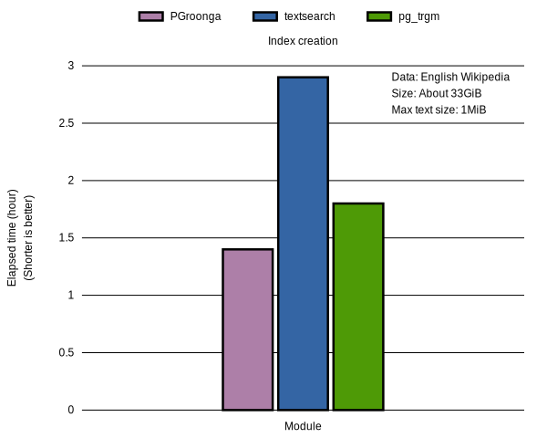
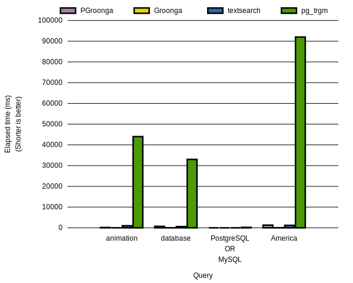
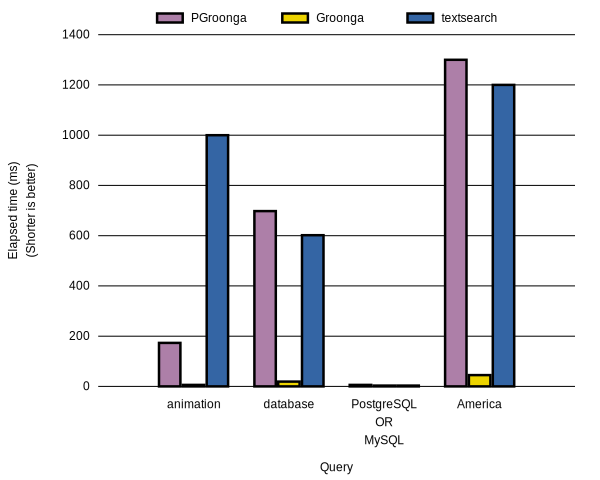

# PGroonga対textsearch対pg\_trgm

PostgreSQLは2つの全文検索モジュールを提供しています。[textsearch]({{ site.postgresql_doc_base_url.ja }}/textsearch.html)と[pg\_trgm]({{ site.postgresql_doc_base_url.ja }}/pgtrgm.html)です。

textsearchモジュールはPostgreSQL組み込みの全文検索機能です。GiSTインデックスとGINインデックスをサポートしています。GiSTインデックスまたはGINインデックスを使うと全文検索性能を高めることができます。

pg\_trgmモジュールはcontribモジュールです。pg\_trgmは全文検索機能を提供します。pg\_trgmもGiSTインデックスとGINインデックスをサポートしています。GiSTインデックスまたはGINインデックスを使うと全文検索機能を高めることができます。

このドキュメントはPGroongaとtextsearchとpg\_trgmの違いを説明します。

## 特徴

各モジュールの特徴は次の通りです。

### PGroonga {#pgroonga}

PGroongaは言語に特化した全文検索も言語に依存しない全文検索もどちらもサポートしています。PGroongaはデフォルトでは言語に依存しない全文検索を使います。通常、PGroongaはデフォルトで十分満足のいく全文検索結果を返します。

PGroongaはデフォルトで言語に依存しない全文検索を使うので、デフォルトですべての言語をサポートしています。ソースコードを変更する必要はありません。

「recheck」する必要がないのでPGroongaの検索は高速です。

PGroongaは更新中の検索をブロックしないので更新中も高速に検索できます。PGroongaは更新中も検索性能を落としません。

PGroongaは更新も高速です。

PGroongaはPostgreSQLに保存しているインデックス対象のテキストも保存しているのでインデックスサイズは大きいです。

### textsearchモジュール {#textsearch}

textsearchモジュールは言語に特化した全文検索を実装しています。英語の単語はステミングされます。「work」も「works」も「worked」もすべて「work」に変換します。ステミングは[再現率](https://ja.wikipedia.org/wiki/%E6%83%85%E5%A0%B1%E6%A4%9C%E7%B4%A2#.E6.A4.9C.E7.B4.A2.E6.80.A7.E8.83.BD.E3.81.AE.E8.A9.95.E4.BE.A1)を高めます。

言語に特価した全文検索はよりよい全文検索機能になるかもしれません。しかし、「言語に特化」しているということはだれかが「言語に特化」した処理をじっそうしなければいけないということです。PostgreSQL 9.6.1は英語やフランス語やロシア語と言った15の言語をサポートしています。しかし、日本語や中国語、韓国語を含むアジアの言語など多くの言語は未対応です。

textsearchモジュールは「recheck」する必要がないので検索は高速です。（重み機能を使う場合は「recheck」が必要です。）

textsearchモジュールは大きなテキストを扱うことができません。テキストの最大バイト数は`1MiB - 1B`です。1MiB以上のテキストを追加した場合は次のエラーが発生します。

```text
string is too long for tsvector (XXX bytes, max 1048575 bytes)
```

### pg\_trgmモジュール {#pg-trgm}

pg\_trgmモジュールは言語に依存しない全文検索を実装しています。しかし、pg\_trgmはASCII以外の文字のサポートが無効になっています。つまり、デフォルトでは日本語や中国語といったアジアの言語はサポートしていないということです。ASCII以外の言語もサポートするには`contrib/pg_trgm/trgm.h`内の次の行をコメントアウトする必要があります。

```c
#define KEEPONLYALNUM
```

Debianベースのシステムを使っている場合は`C.UTF-8`ロケールを使うことでpg\_trgmのソースコードを変更しなくても非ASCII文字サポートを有効にできます。

pg\_trgmモジュールは大量のドキュメントがマッチして各ドキュメントが長い場合は遅いです。なぜならpg\_trgmはインデックスを使った検索のあとに「recheck」する必要があるからです。

### 概要 {#summary}

モジュール | サポートしている言語                  | 検索     | 更新         | インデックスサイズ
---------- | ------------------------------------ | ------- | ------------ | -------
PGroonga   | 全言語                               | 速い     | 速い         | 大きい
textsearch | 15（アジアの言語は未サポート）        | 速い     | とても遅い   | 小さい
pg\_trgm   | ASCIIのみの言語                      | 遅い     | 遅い         | 小さい

## ベンチマーク {#benchmark}

このセクションでは英語版Wikipediaを使ったベンチマーク結果を示します。ベンチマークスクリプトは[postgresql.sh](https://github.com/groonga/wikipedia-search/blob/master/benchmark/centos7/postgresql.sh)にあります。

### 概要

以下は全文検索インデックス作成のベンチマーク結果の概要です。

  * PGroongaが一番速いモジュールです。

  * pg\_trgmはPGroongaよりも30%遅いです。

  * textsearchはPGroongaよりも2倍遅いです。



以下は全文検索インデックスのサイズのベンチマーク結果の概要です。

  * pg\_trgmが一番小さいモジュールです。

  * textsearchはpg\_trgmよりも60%大きいです。

  * PGroongaはpg\_trgmよりも5倍大きいです。


以下は全文検索性能のベンチマーク結果の概要です。

  * pg\_trgmの全文検索性能は他のモジュールよりも圧倒的に悪いです。

  * PGroongaとtextsearchの全文検索性能は同じくらいです。

  * Groongaの全文検索機能はPGroonga・textsearchよりも10倍以上高速です。GroongaはPGroongaが使っている全文検索エンジンです。



以下はpg\_trgmが遅すぎるのでpg\_trgmを除いた全文検索性能のグラフです。



### 環境

以下はベンチマーク環境です。

CPU        | Intel(R) Xeon(R) CPU E5-2660 v3 @ 2.60GHz (24cores)
メモリー   | 32GiB
スワップ   | 2GiB
ストレージ | SSD (500GB)
OS        | CentOS 7.2

### バージョン

以下はソフトウェアのバージョンです。

PostgreSQL | PGroonga
---------- | --------
9.6.1      | 1.1.9

### データ

以下は対象データの統計情報です。

サイズ                 | 約33GiB
レコード数             | 約530万件
タイトルの平均バイト数 | 約19.6B
タイトルの最大バイト数 | 211B
本文の平均バイト数     | 約6.4KiB
本文の最大バイト数     | 約1MiB（1047190B）

本文の最大バイト数が1MiB未満なのはtextsearchには重要なポイントです。もし、1MiB - 1B以上なら以下のエラーが発生してtextsearchのインデックスを作成できないからです。

```text
string is too long for tsvector (1618908 bytes, max 1048575 bytes)
```

### データロード

以下はデータロードのベンチマーク結果です。全文検索モジュールには依存しません。なぜならどのインデックスもまだ作られていないからです。

経過時間 | データベースサイズ
-------- | -----------------
約26分   | 約21GB

以下はデータをロードするSQLです。

```sql
COPY wikipedia FROM 'en-all-pages.csv' WITH CSV ENCODING 'utf8';
```

このCSVデータは[en-all-pages.csv.xz](http://packages.groonga.org/tmp/en-all-pages.csv.xz)からダウンロードできます。

以下は`wikipedia`テーブルを定義するSQLです。

```sql
CREATE TABLE wikipedia (
  id integer PRIMARY KEY,
  title text,
  text text
);
```

### インデックス作成

以下は全文検索インデックス作成のベンチマーク結果です。

モジュール  | 経過時間   | インデックスのサイズ | 備考
---------- | ----------- | ------------------ | --------------------------------------------------------------------------------------------------------------------------------
PGroonga   | 約1時間24分 | 約39GB             | PGroongaはデータをコピーしてそれに対してインデックスを作成します。データはzlibで圧縮しています。インデックスだけのサイズは約27GBです。
textsearch | 約2時間53分 | 約12GB             | `maintenance_work_mem`は`2GB`です。インデックスに登録できなかった単語が3923あります。(*)
pg\_trgm   | 約1時間50分 | 約7.6GB            | `maintenance_work_mem`は`2GB`です。

(*) このケースが発生したときのエラーメッセージは以下の通りです。

```text
NOTICE:  word is too long to be indexed
DETAIL:  Words longer than 2047 characters are ignored.
```

PGroongaのインデックス定義は以下の通りです。

```sql
CREATE INDEX wikipedia_index_pgroonga ON wikipedia
 USING pgroonga (title, text);
```

textsearchのインデックス定義は以下の通りです。

```sql
CREATE INDEX wikipedia_index_textsearch ON wikipedia
 USING GIN (to_tsvector('english', title),
            to_tsvector('english', text));
```

pg\_trgmのインデックス定義は以下の通りです。

```sql
CREATE INDEX wikipedia_index_pg_trgm ON wikipedia
 USING GIN (title gin_trgm_ops, text gin_trgm_ops);
```

### 全文検索

全文検索のベンチマーク結果は以下の通りです。

  * 「Groonga」は`pgroonga.command('select ...')`の結果です。[`pgroonga.command`](functions/pgroonga-command.html)も参照してください。

  * 「相対経過時間」は対象の経過時間と最速のケースの経過時間の比率です。大きいほど遅いです。

クエリー：「animation」

モジュール  | 経過時間     | ヒット数 | 相対経過時間 | 備考
---------- | ------------ | -------- | ----------- | ----
PGroonga   | 約173ミリ秒  | 約4万件  | 約29         |
Groonga    | 約6ミリ秒    | 約4万件  | 1            |
textsearch | 約1秒        | 約42万件 | 約167        | 他のケースよりもヒット数が10倍多いです。これはステミングのためです。「animation」はステミングされると「anim」になり、「anim」で検索しています。
pg\_trgm   | 約44秒       | 約3万件  | 約7333       |

クエリー：「database」

モジュール | 経過時間     | ヒット数 | 相対経過時間
---------- | ----------- | -------- | -----------
PGroonga   | 約698ミリ秒 | 約21万件  | 約37
Groonga    | 約19ミリ秒  | 約21万件  | 1
textsearch | 約602ミリ秒 | 約19万件  | 約32
pg\_trgm   | 約33秒      | 約13万件  | 約1736


クエリー：「PostgreSQL OR MySQL」

モジュール  | 経過時間   | ヒット数 | 相対経過時間
---------- | ---------- | -------- | -----------
PGroonga   | 約6ミリ秒   | 1636件   | 約2
Groonga    | 約3ミリ秒   | 1636件   | 1
textsearch | 約3ミリ秒   | 1506件   | 1
pg\_trgm   | 約241ミリ秒 | 1484件   | 約80

クエリー：「America」

モジュール | 経過時間    | ヒット件数 | 相対経過時間
---------- | ---------- | ---------- | -----------
PGroonga   | 約1.3秒    | 約47万件   | 約29
Groonga    | 約45ミリ秒 | 約47万件   | 1
textsearch | 約1.2秒    | 約48万件   | 約26
pg\_trgm   | 約1分32秒  | 約140万件  | 約2044
